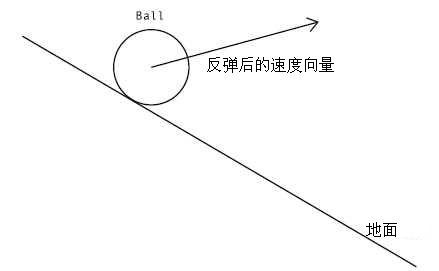

##### 一:已知半径和角度的旋转

运用三角函数可以很容易的根据半径和角度求出下一点旋转的坐标

代码如下:

    package {
    	import flash.display.Sprite;
    	import flash.events.Event;
    	public class BaseRotate extends Sprite {

    		public function BaseRotate() {
    			_init();
    		}

    		private var ball:Ball;
    		private function _init():void {
    			ball = new Ball();
    			addChild(ball);
    			addEventListener(Event.ENTER_FRAME, onEnterFrame);
    		}

    		private var angle:Number = 0;//旋转角度
    		private var radius:Number = 150;//半径
    		private var vr:Number = .05;//旋转速度
    		private function onEnterFrame(e:Event):void
    		{
    			ball.x = Math.cos(angle) * radius;
    			ball.y = Math.sin(angle) * radius;

    			angle += vr;
    		}
    	}
    }

(Ball 类的定义在[这里](http://tomyail.72pines.com/2010/10/02/flash-actionscript30-3d%E5%9F%BA%E7%A1%80%E6%95%99%E7%A8%8B%E4%B8%8D%E4%BD%BF%E7%94%A8%E5%86%85%E7%BD%AE%E7%9A%84z%E8%BD%B4%E5%B1%9E%E6%80%A7/))

对于一些简单并且计算量不是很大的程序,这种方法足够了.但对于一些复杂的计算这种方式未免有些愚笨.因为大多数情况下我们可能只知道物体当前的坐标还有中心点的坐标,通过这种方法我们必须先算出角度和半径

```js
var dx: Number = ball.x - centerX;
var dy: Number = ball.y - centerY;
var angle: Number = Math.atan2(dy, dx);
var radius: Number = Math.sqrt(dx * dx + dy * dy);
```

##### 二:坐标旋转公式计算旋转坐标

这是推荐使用新的求坐标旋转的方法先给出公式

<span style="text-decoration: underline;">x1 = cos(angle)\_x - sin(angle)\_y;</span>

<span style="text-decoration: underline;">y1 = cos(angle)\_y + sin(angle)\_x;</span>

这里的 x1 和 y1 就是旋转之后的新坐标,注意,_angle 表示的是原坐标和当前坐标之间的角度._

\_ \_推导过程如下:

1.  设 A 点旋转前的角度为 δ，则旋转(逆时针)到 C 点后角度为 δ+β

2.  求 A，B 两点的距离：dist1=|AB|=y/sin(δ)=x/cos(δ)

3.  求 C，B 两点的距离：dist2=|CB|=d/sin(δ+β)=c/cos(δ+β)

4.  显然 dist1=dist2，设 dist1=r 所以： r=x/cos(δ)=y/sin(δ)=d/sin(δ+β)=c/cos(δ+β)

5.  由三角函数两角和差公式知： sin(δ+β)=sin(δ)cos(β)+cos(δ)sin(β) cos(δ+β)=cos(δ)cos(β)-sin(δ)sin(β)

所以得出：

c=r_cos(δ+β)=r_cos(δ)cos(β)-r\*sin(δ)sin(β)=xcos(β)-ysin(β)

d=r_sin(δ+β)=r_sin(δ)cos(β)+r\*cos(δ)sin(β)=ycos(β)+xsin(β)

即旋转后的坐标 c，d 只与旋转前的坐标 x，y 及旋转的角度 β 有关

[这里](http://www.valdosta.edu/~cbarnbau/math_demos_folder/coor_vecs/vec_rot.htm)有一个动画演示 以下是利用转轴公式写的代码

    package {
    	import flash.display.Sprite;
    	import flash.events.Event;
    	public class BaseRotate extends Sprite {

    		public function BaseRotate() {
    			_init();
    		}

    		private var ball:Ball;
    		private function _init():void {
    			ball = new Ball();
    			addChild(ball);
    			addEventListener(Event.ENTER_FRAME, onEnterFrame);
    		}

    		private var vr:Number = .05;//旋转速度
    		private var cos:Number = Math.cos(vr);
    		private var sin:Number = Math.sin(vr);
    		private function onEnterFrame(e:Event):void
    		{
    			ball.x = cos * ball.x - sin * ball.y;
    			ball.y = cos * ball.y + sin * ball.x;
    		}
    	}
    }

由于这里的旋转是匀速的,所以并没有每次都计算 cos 和 sin 的值,这里就节省和很多计算量!

##### 三:旋转坐标公式的一个应用(沿着某一个特定斜角反弹)

在物体运动的边界检测中,一种处理手段就是碰到边界之后反弹,如果边界是水平或者垂直的,只要把原先的相应分速度乘以-1 便可以反使之反向运动,但如果我们的边界不是水平或者垂直的话就比较麻烦了.学过高中物理的可能马上会运用力的分解和力的合成解决.但这里我们可以换个思路:_**旋转现有倾斜的坐标系使之成为标准的坐标系,反弹之后再旋转回原先的坐标系.**_

以下是图式:

]
]
]
]

好了,亮代码:-)

这是简单版的

    package com.tomyail.display.testCase {
    	/*
    	 *沿角度回弹简单测试
    	 */

    	import com.tomyail.display.base.Ball;

    	import flash.display.Sprite;
    	import flash.display.Stage;
    	import flash.events.Event;
    	import flash.geom.Rectangle;

    	/**
    	 *
    	 * @author Tomyail
    	 */
    	public class AngleBounceBad extends Sprite {
    		public function AngleBounceBad(sg:Stage) {
    			this.sg = sg;
    			this.bounds = new Rectangle(sg.x, sg.y, sg.stageWidth, sg.stageHeight);
    			trace(bounds)
    			_init();
    		}

    		private var ball:Ball;

    		private var line:Sprite;

    		//反弹度
    		private var bounce:Number = -0.8;

    		//墙壁边界
    		private var bounds:Rectangle;

    		private var lineBounds:Rectangle;

    		//重力加速度
    		private var gravity:Number = 0.2;

    		private var sg:Stage;
    		private var testBall:Ball;

    		private function _init():void {

    			ball = new Ball();
    			addChild(ball);
    			ball.x = 100;
    			ball.y = 300;
    			ball.vx = 1
    			ball.vy = -5;

    			line = new Sprite();
    			line.graphics.lineStyle(1);
    			line.graphics.lineTo(300, 0);
    			addChild(line);
    			line.x = 50;
    			line.y = 50;
    			line.rotation = 30;

    			addEventListener(Event.ENTER_FRAME, onEnterFrame);
    		}

    		private function onEnterFrame(e:Event):void {

    			line.rotation = (sg.stageWidth / 2 - mouseX) * .1;
    			//ball.vy += gravity;

    			ball.x += ball.vx;
    			ball.y += ball.vy;

    			var angle:Number = line.rotation * Math.PI / 180;
    			var cos:Number = Math.cos(angle);
    			var sin:Number = Math.sin(angle);

    			var dx:Number = ball.x - line.x;
    			var dy:Number = ball.y - line.y;

    			var x1:Number = cos*dx + sin*dy;
    			var y1:Number = cos*dy - sin*dx;

    			var vx1:Number = cos*ball.vx + sin * ball.vy;
    			var vy1:Number = cos* ball.vy - sin*ball.vx;

    			if(y1<0&&y1+ball.radius>0){
    				y1 = -ball.radius;
    				vy1 *= bounce;
    			}else if(y1>0 && y1-ball.radius<0){
    				y1 = ball.radius;
    				vy1  *= bounce;
    			}

    			dx = cos*x1-sin*y1;
    			dy = cos*y1 + sin*x1;

    			ball.x = dx+line.x;
    			ball.y = dy+line.y;
    			ball.vx = cos*vx1 - sin*vy1;
    			ball.vy = cos*vy1 + sin*vx1;

    		}
    	}

    }

以下是优化后的:

    package com.tomyail.display.testCase {
    	/*
    	 *沿角度回弹简单测试
    	 */

    	import com.tomyail.display.base.Ball;

    	import flash.display.Sprite;
    	import flash.display.Stage;
    	import flash.events.Event;
    	import flash.geom.Rectangle;

    	/**
    	 *
    	 * @author Tomyail
    	 */
    	public class AngleBounce extends Sprite {
    		public function AngleBounce(sg:Stage) {
    			this.sg = sg;
    			this.bounds = new Rectangle(sg.x, sg.y, sg.stageWidth, sg.stageHeight);
    			trace(bounds)
    			_init();
    		}

    		private var ball:Ball;

    		private var line:Sprite;

    		//反弹度
    		private var bounce:Number = -0.8;

    		//墙壁边界
    		private var bounds:Rectangle;

    		private var lineBounds:Rectangle;

    		//重力加速度
    		private var gravity:Number = 0.2;

    		private var sg:Stage;

    		private var testBall:Ball;

    		private function _init():void {

    			ball = new Ball();
    			addChild(ball);
    			ball.x = 100;
    			ball.y = 50;
    			ball.vx = 5
    			ball.vy = 5;

    			line = new Sprite();
    			line.graphics.lineStyle(1);
    			line.graphics.lineTo(300, 0);
    			addChild(line);
    			line.x = 50;
    			line.y = 150;
    			line.rotation = 30;

    			addEventListener(Event.ENTER_FRAME, onEnterFrame);
    		}

    		//检查墙壁碰撞和反弹
    		private function checkBounds():void {
    			if (ball.x + ball.radius > bounds.right) {
    				ball.x = bounds.right - ball.radius;
    				ball.vx *= -1;
    			} else if (ball.x - ball.radius < bounds.left) {
    				ball.x = bounds.left + ball.radius;
    				ball.vx *= -1;
    			}

    			if (ball.y + ball.radius > bounds.bottom) {
    				ball.y = bounds.bottom - ball.radius;
    				ball.vy *= -1;
    			} else if (ball.y - ball.radius < bounds.top) {
    				ball.y = bounds.top + ball.radius;
    				ball.vy *= -1
    			}
    		}

    		//检查直线碰撞和反弹
    		private function checkLine():void {
    			//获取直线相对于舞台的外边框大小
    			lineBounds = line.getBounds(sg);

    			//首先判断小球是否在能接触到直线的范围内
    			if (ball.x - ball.radius > lineBounds.left && ball.x + ball.radius < lineBounds.right) {
    				//得到旋转角度,正弦和余弦
    				var angle:Number = line.rotation * Math.PI / 180;
    				var cos:Number = Math.cos(angle);
    				var sin:Number = Math.sin(angle);

    				//小球相对于直线的坐标
    				var dx:Number = ball.x - line.x;
    				var dy:Number = ball.y - line.y;

    				//逆时针旋转坐标
    				//var x1:Number = cos*dx + sin*dy;
    				var y1:Number = cos * dy - sin * dx;

    				//判断是否达到回弹距离(这里需要注意flash坐标系统中向下为y轴正方向)
    				if (y1 < 0 && y1 + ball.radius > 0) { //物体在直线上方
    					y1 = -ball.radius;
    					turnBack();
    				} else if (y1 > 0 && y1 - ball.radius < 0) { //物体在直线下方
    					y1 = ball.radius;
    					turnBack();

    				}

    			}

    			function turnBack():void {

    				var x1:Number = cos * dx + sin * dy;

    				//逆时针旋转速度
    				var vx1:Number = cos * ball.vx + sin * ball.vy;
    				var vy1:Number = cos * ball.vy - sin * ball.vx;

    				vy1 *= bounce;

    				//顺时针旋转坐标
    				dx = cos * x1 - sin * y1;
    				dy = cos * y1 + sin * x1;

    				ball.x = dx + line.x;
    				ball.y = dy + line.y;

    				//顺时针旋转速度
    				ball.vx = cos * vx1 - sin * vy1;
    				ball.vy = cos * vy1 + sin * vx1;
    			}
    		}

    		private function onEnterFrame(e:Event):void {

    			line.rotation = (sg.stageWidth / 2 - mouseX) * .1;

    			ball.vy += gravity;
    			ball.x += ball.vx;
    			ball.y += ball.vy;

    			checkBounds();
    			checkLine();
    		}
    	}

    }

参考资料:

<http://wenku.baidu.com/view/8d1a7aeae009581b6bd9eb58.html>

<http://www.cnblogs.com/ywxgod/archive/2010/08/06/1793609.html>
