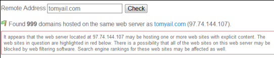

从购买域名空间到现在正式使用也快一周了，今天过来写下使用感受。

因为是全球最大域名提供商，所以选择在 Godaddy 上注册域名的，后来为了省事夹杂着先入为主的观念还是选择了在 Godaddy 上购买空间。

进入去他爹的网站给人的第一感觉是页面花花绿绿的什么都有，这对于我这个新手来说多少有些郁闷。购买的过程中多次推荐给你推荐一些相关的产品，真是把网络营销中的提升销售的概念应用的淋漓尽致。Godaddy 的优惠码是个好东西，来源很多每天更新，能省很多钱。

也许根据 IP 判断默认给我用的服务器是亚洲的（网上说数据中心在新加坡），域名解析完之后发现速度相当不给力，后来在网上声音一边倒的说美国服务器好的情况下我也决定换成美国服务器的。由于对 Godaddy 网站的操作有些地方还不是很熟悉，所以我直接删除了原有的空间，原以为这个时候就能直接再选一个新的，后来才知道 Godaddy 并没有这个功能，没办法只能用我过了四级水平的英语写邮件给客服。客服的答复是我只能通过重新买一次相同类型的空间并选择最低时间之后他们会自己将之前剩余的时间叠加到我新买的空间上去，我照做了。为此又多花了一点美元购买了空间的时间，后来嫌麻烦我也懒得叫他们退款了。

但是最尴尬的是新买的空间所分配过来的 IP 直接被 GFW 了，因为是共享虚拟主机，多个域名同用一个 IP，所以你保证不了和你同一个 IP 的其他人是不是放了反和谐内容。后来我用[youGetSignal](http://goo.gl/B1uL)才知道当时那个服务器资源分配给了将近 1000 个域名使用，以下是截图：

网上提供了换 IP 的方法：就是换这个空间所使用的操作系统，换的途中手贱点了 Godaddy 的云主机（也就是官方说的第四到服务器 4GH，[具体功能](http://goo.gl/oDiu)按照我的理解就是：多台服务器共同协同工作达到负载均衡并可减轻 dDOS）。等了将近 1 天之后新的 IP 终于可以用了！这次查了下这台服务器的使用人数，还好只有 91 个，不过根据上一个服务器的情况判断，指不定 Godaddy 会往上面提添加多少用户。

使用异乡的服务器用自由换来的代价就是服务器连接速度很不稳定，今天早上用 Chrome 浏览发现加载网页的小菊花一直在转，网站一直没法载入。以下是我不定期的 ping 我的主机得到的结果：

总结：对于一个一年 40 左右美元空间我觉得还算凑合吧，如果各位有更好的可以推荐了，当然广告什么的另当别论了：-）
