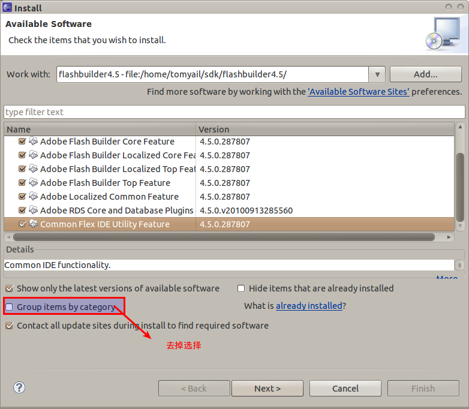
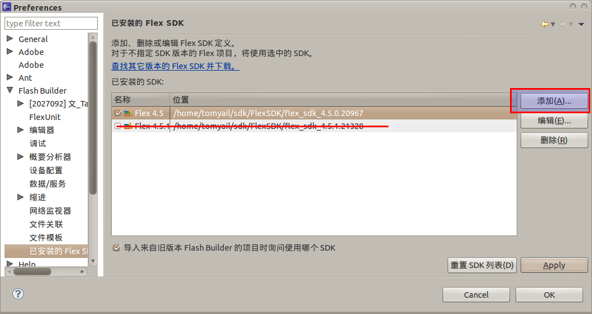

### 1：下载 Eclipse

<pre> sudo apt-get install eclipse</pre>

### 2：下载 fb4linux 插件

fb4linux 是专门针对 linux 下的 eclipse 能够使用 flashbuilder 而开发的项目，[主页](http://code.google.com/p/fb4linux/)上还有一些更加详尽的说明。

2.1： [下载最新版本 flashbuilder4.5 for linux](http://fb4linux.googlecode.com/files/Burrito4Linux.tar.bz2) 并解压到任意目录。比如我将其解压并重命名成 flashbuilder4.5 并放在/home/tomyail/sdk 目录下

2.2：点击[这里](http://www.brighthub.com/hubfolio/matthew-casperson/media/p/78806/download.aspx)下载该插件需要的环境支持，并将这些插件放入/usr/lib/eclipse/plugins 目录下。这些文件包括：

* com.adobe.coldfusion.rds.client_1.0.266425.jar
* javax.wsdl_1.6.2.v200806030405.jar
* org.apache.commons.lang_2.3.0.v200803061910.jar
* org.apache.xerces_2.8.0.v200803070308.jar
* org.apache.xml.resolver*1.1.0.v200806030311.jar
  2.3：打开 eclipse 安装插件：Eclipse 3.5.2 下安装插件的方法是依次打开 Help->Install new Software 点击 add 按钮选择 local 安装，之后选中刚刚解压并重命名的 flashbuilder4.5.点击确定之后就能添加新的软件源了。接着全选（或者按 需）安装。***如果没有发现可用的安装是因为系统默认选择了"Group items by categroy”**，去掉即可\_，如下图所示：

安装完后之后重启 eclipse。

### 3：配置 SDK

3.1：去[FlexSDK 的官方网站](http://opensource.adobe.com/wiki/display/flexsdk/Download+Flex+4.5) 下载 FlexSDK4.5，注意不要选择 4.5.1.21328 版本的，我试过使用该 SDK 会出现*VerifyError: Error #1014: 无法找到类 spark.components.supportClasses::ItemRenderer*的错误提示，原因可能是 fb4linux 只支持 4.5。

3.2：我将其重命名并放在了/homr/tomyail/sdk/FlexSDK 下面，然后打开 eclipse 选择 Windows 下面的 Preference 菜单，具体位置见图：

3.3(选）:如果需要进行 AIR 开发请下载 AIRSDK 并覆盖到原本的 FLEXSDK 目录下，[AIRSDK 下载](http://airdownload.adobe.com/air/win/download/latest/AdobeAIRSDK.zip)。

### 4：安装 flashdebugger

linux 下安装 flashdebug 没有 win 下那么自动，需要自己复制文件安装。通过在 chrome 下输入 about:plugins 我找出了其 flash 插件的安装位置，于是只要去[官方](http://www.adobe.com/support/flashplayer/downloads.html) [下载 flashdebugger for linux](http://download.macromedia.com/pub/flashplayer/updaters/10/flashplayer_10_plugin_debug.tar.gz)，将所有文件解压到/usr/lib/adobe-flashplugin/目录下即可

### 5:运行你的 HelloWorld

通过 File->Others 找到 Flashbuilder 项目新建项目运行即可。发张最后 的效果图:-）

PS:运行以上测试前请确保系统已经安装了 Flashbuilder 以及 Adobe AIR，这些都可以通过 Ubutnu 软件中心的 Canonical 合作伙伴那里下载

更多资料：

* [Installing FB4Linux in Eclipse ](http://www.brighthub.com/hubfolio/matthew-casperson/articles/78818.aspx)
* [Adobe® AIR on Gentoo Linux](http://www.flashinthepan.ca/computer-tips/linux-computer-tips/adobe-air-on-gentoo-linux)
* [Flash Builder 4 For Linux](http://zengrong.net/post/1024.htm)
