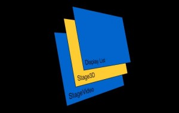

## 层的概念

在基于 GPU 加速的 Flash Molehill 引擎中，所有的渲染其实都是围绕着 Stage3D 层展开的，Stage3D 层的下层是 StageVideo，Stage3D 的上层的通常的显示列表层。这个层系统说明*显示列表的图形将始终盖在 Stage3D 上面*，如果你在舞台上同时创建一个 Sprite 和一个 Stage3D，即使 Sprite 是首先通过 addChild 添加到舞台的，它也会出现在 Stage3D 的上面（即盖住 stage3D 对象）。

如果你安装了 Debug 版本的 Flash Player，区别舞台上的一个对象是否是 stage3D 对象的最简单的方法就是右击显示重绘区，由于 stage3D 不属于 DisplayObject，所有即使打开重绘区也是看不到红框框的。

Stage3D 层中共包含多个 stage3D 实例，它们被存放在 stage.stage3Ds 的数组里面，这个根据 API 中的说明，这个数组长度由平台决定的，我的电脑上是 4，由于 stage3D 在每次渲染之前都需要调用 clear()函数，所以我还不知道这 4 个 stage3D 是否也拥有像显示列表那样的层级关系。

## 坐标系统

Stage3D 采用右手坐标系，伸出你的右手，使食指向上，其余三指向你，拇指这是指向坐，这就是右手坐标。拇指，食指和其余三指分别代表 x，y，z 的正方向。

默认情况下 stage3D 的坐标坐标原点是"舞台”的中心位置，需要注意的是这里的舞台是加引号的，也就是说这个舞台并不一定对应于 stage，而是通过 context3D 的 configureBackBuffer 方法传入 width 和 height 来定义舞台大小的。

最后关于坐标系统的另外一个很重要的注意点就是 stage3D 默认的坐标系统属于齐次裁剪空间（homogeneous clip space）在这个系统下坐标值被标准化了，所谓的标准化就是让方向上面的向量（x，y，z）的坐标值域限定在[-1,1],通常情况下我们需要将这个坐标系统转换成窗口坐标，也就是 Flash 里面默认的坐标系，这个过程转换过程反映到代码上就是使用 setProgramConstantsFromMatrix 方法并传入转换矩阵来实现的。

## 颜色混合

默认情况下 Stage3D 里面的颜色是覆盖的，也就是说没有 Alpha，滤镜等混合模式，需要调用 Context 的 Context3DBlendFactor 方法设置，通常情况下我们需要设置成 Alpha 模式,即 setBlendFactors(Context3DBlendFactor.SOURCE_ALPHA,Context3DBlendFactor.ONE_MINUS_SOURCE_ALPHA)，并对颜色进行 Alpha 通道计算，具体参考 Context3DBlendFactor 类给出的类说明和例子。

**最后建议多看官方手册，Context3D 的[中文 API 手册](http://help.adobe.com/zh_CN/FlashPlatform/reference/actionscript/3/flash/display3D/Context3D.html)已经放出，没事可以多翻翻**
