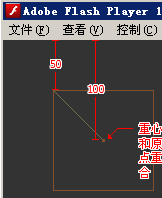
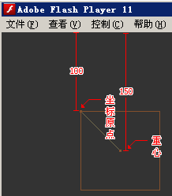
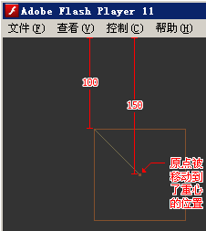

### Body 的类型:

* BodyType.DYNAMIC(默认):用来模拟现实世界的刚体,拥有质量并且一旦加入 Nape 的空间(Space)里便会自动受到各种力的作用
* BodyType.STATIC:不受各种力的作用(设置其 force 属性会报错)
* BodyType.KINEMATIC:特征和静态刚体(STATIC Body)一样,但是可以设置其 velocity 属性来改变速度
  Body 不是简单的质点,所有的 Body 都是有形状和体积的,默认情况下都会进行碰撞检测.

### Shape:

Body 的 shapes 的属性用来维护其所对应的形状列表,都是 Shape 类型.

Nape 里面的 Shape 类型用来定义物体的物理形状,Shape 类有两个子类:Circle(圆形)和 Polygon(多边形).

Shape 类的 Material 用来设置物体的物理属性比如密度,弹力,最大静摩擦力等等.

官方文档首页 [UML 图](http://napephys.com/docs/index.html)比较清楚的阐明了这几个类之间的关系.

<!--more-->

### 刚体的两个"心":

刚体有两个心,重心和局部坐标系原点.需要注意的是刚体**总是**按照其局部坐标系的原点进行旋转的,而重心都是位于刚体的形状中心的.如果刚体的局部坐标原点和其重心不重合就会产生力矩,在刚体自由落体时就会发生旋转.

Nape 的 Debug 有两个布尔属性**drawBodyDetail**和**drawShapeDetail**

drawBodyDetail 表示是否绘制坐标原点,用**实心**方块表示.

drawShapeDetail 表示是否绘制重心,用**空心**方块表示.

如下图:


Polygon 有两个静态方法 box 和 rect,两者的区别就是刚体两个心的位置

* 利用 box 方法创建的 shape 重心和坐标原点都在方块的中央
* 利用 rect 方法创建的 shape 原点在左上角,重心在形状的中心,所以下落时会绕原点进行旋转

### 例子

#### (1):利用 box 函数创建刚体测试

```js
body = new Body(BodyType.KINEMATIC);
shape = new Polygon(Polygon.box(100, 100));
body.shapes.add(shape);
body.position.y = 100;
body.position.x = 100;

//强制刷新
space.step(1 / 60);
trace(shape.localCOM); //输出(0,0)
trace(body.position); //输出(100,100)
```

运行截图:



利用**box**创建的刚体重心和原点都在方块的中点

#### (2):利用 rect 函数创建刚体测试

```js
body = new Body(BodyType.KINEMATIC);
shape = new Polygon(Polygon.rect(0, 0, 100, 100));
body.shapes.add(shape);
body.position.y = 100;
body.position.x = 100;
space.bodies.add(body);

//强制刷新
space.step(1 / 60);
trace(shape.localCOM); //输出(50,50)
trace(body.position); //输出(100,100)
```

运行截图:



利用 rect 创建的刚体重心原点在(100,100)的位置,也就是左上角.重心在(150,150)的位置,也就是刚体的形状中心.

修改重心 localCOM(local Center of Mass)的坐标参考系是相对于其局部坐标,也就是这里 local 的含义吧,重心是相对于局部坐标系的偏移.

#### (3)测试 algin()的作用

```js
body = new Body(BodyType.KINEMATIC);
shape = new Polygon(Polygon.rect(0, 0, 100, 100));
body.shapes.add(shape);
body.position.y = 100;
body.position.x = 100;
space.bodies.add(body);

body.align();
//强制刷新
space.step(1 / 60);
trace(shape.localCOM); //输出(0,0)
trace(body.position); //输出(150,150)
```

运行截图:



align()的作用是将坐标系原点移动到重心点上去.

**所以 align 会改变刚体的坐标位置.如上图所示,本来我设置的坐标点是(100,100),align 之后的坐标点跑到了(150,150)上**

#### 参考文档:

<http://napephys.com/help/manual.html#Hello_Nape>

[Understanding Box2D kinematic bodies](http://www.emanueleferonato.com/2012/05/11/understanding-box2d-kinematic-bodies/)

[此文的源码](https://github.com/Tomyail/mixTest/blob/master/src/nape/CenterMass.as)
