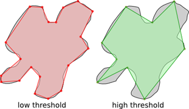
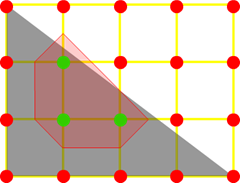
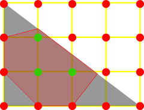

### Polygon 和 GeomPoly 的关系

Polygon 的构造函数和接收 GeomPoly.

### Polygon 的 regular 算法

    keep public static function regular(xRadius:Float, yRadius:Float, edgeCount:Int, angleOffset=0.0, weak:Bool=false):Array<Vec2> {

            DEBUG(if(isNaN(xRadius) || isNaN(yRadius) || isNaN(angleOffset))

                throw "Error: Polygon.regular cannot accept NaN arguments";

            )

            var ret = [];

            var dangle = Math.PI*2/edgeCount;

            for(i in 0...edgeCount) {

                var ang = i*dangle + angleOffset;

                var x = Vec2.get(Math.cos(ang)*xRadius,Math.sin(ang)*yRadius,weak);

                ret.push(x);

            }

            return ret;

        }

<!--more-->

### 多边形的分类

**三角形(\*\***Triangular\***\*)**是由三条线段顺次首尾相连，组成的一个闭合的平面图形是最基本的多边形

**凸多边形(\*\***Convex)\*\*的是一个内部为凸集的简单多边形.简单多边形的下列性质与其凸性等价:

* 每个内角小于或等于 180 度.
* 任何两个顶点间的线段位于多边形的内部或边界上.
  **Y 单调多边形(\*\***Y-Monotone)\*\* 任意水平线和这个多边形的交点至多只有两点的多边形

(图片来源:[Monotone polygon](http://en.wikipedia.org/wiki/Monotone_polygon))

上图中前两个都是单调多边形.

**凹多边形(\*\***Concave)\*\*:只要有一个内角大于 180 度,这个多边形就是凹的.

凹凸多边形的[交互动画](http://www.mathopenref.com/polygonconvex.html):

**简单多边形:**是指不相邻的边没有公共交点的多边形(The number of edges always equals the number of vertices)

**Weakly-Simple 弱简单多边形**

这个还不是很理解,多边形中间有空洞,通过给封闭区域加切线的方式转换过来应该就是弱简单多边形,具体可以参照下面两篇文章

1:[Weakly_simple_polygon](http://en.wikipedia.org/wiki/Simple_polygon#Weakly_simple_polygon)

2:[复杂多变形与简单多边形](http://blog.sina.com.cn/s/blog_45eac68601012xbi.html)

3:[Polygon](https://en.wikipedia.org/wiki/Polygon)(有中文)

### 多边形的关系

(图片来自[nape_manual](http://napephys.com/help/manual.html))

### 多边形的分解

为什么要有多边形分解的概念,因为 Shape 里面的

Polygon 只接受凸多边形(?).

**simpleDecomposition** 将一个复杂多边形转换成弱简单多边形([分解算法](http://en.wikipedia.org/wiki/Bentley%E2%80%93Ottmann_algorithm))

其他分解:

**monotoneDecomposition**, **convexDecomposition** 和 **triangularDecomposition** 将**弱简单多边形**转换成指定类型的多边形.(图片来自[nape_manual](http://napephys.com/help/manual.html))

### 多边形的简单化 (Simplification)

如果有几个点的距离很进,那一通过这个方法将这几个点合并成两个点,这就是简单化的基本思想.(图片来自[nape_manual](http://napephys.com/help/manual.html))

简单化相关讨论:

[Re: Milestone 6 - Help](http://deltaluca.me.uk/forum/index.php/mv/msg/233/1471/2bacca04559c71983a14f387cb05287f/#msg_1471)

[Problem with glued bodies](http://deltaluca.me.uk/forum/index.php/m/2295/5fa24570e93cf8097a521602778d5bd2/?srch=simplify#msg_2295)

[Re: Any way to speed-up or cache object creation?](http://deltaluca.me.uk/forum/index.php/m/490/5fa24570e93cf8097a521602778d5bd2/?srch=simplify#msg_490)

### 理解 MarchingSquares 算法

利用 MarchingSquares 算法可以将一个不规则形状的轮廓通过一系列点来描述出来,

在不理解 MarchingSquares 算法的前提下看 Nape 里面 MarchingSquares 的 API 真是云里雾里,在参考了维基和 Nape 的具体表现后对这个算法有了一定的了解.

下面通过一个简单实例说明下其实现原理,这个实例用了一个简单的三角形做例子,对于复杂不规则多边形,思路是一样的.下图灰色的就是这个三角形,宽 400px,高 300px.

1.首先 MarchingSquares 需要将这个形状映射到一个网格上去,网格单元越小,精度越高,为了绘制方便我们假设网格尺寸是 100px(对于实际应用中,像素在 4-10 都是可以接受的),那么这个形状映射到网格就是这样的(黄线就是网格):

.png> "Image(1)")

2:遍历所有网格顶点,并应用一个规则(isoFun)为所有顶点赋值.这里的 isoFun 按照特定应用需求可能不一样,最基本的类似于这样:如果顶点和这个形状接触返回-1,否则返回 1.

遍历之后如下图(图中红色表示不接触,绿色表示接触[-1])

3:按照这样表(右下角)将每个小网格分割

得到图形:

维基中最后一步还利用了一个叫"线性插值"的运算规则提高精度,但是在 Nape 中并没有找到这种方法.也就是说 Nape 在走到这里应该就停止并返回途中红色区域的所有点阵.

很明显这个精度明显是不够的,在 Nape 中通过一个叫 quality 的参数进行控制,上图就是 quality 是 0 的情况.

4:quality 参数的作用是对网格做进一步细分,下面演示当 quality 是 1 的情况.

可以将每个网格再分一次.如下图(灰线表示子网格轮廓)

.png> "Image(2)")

5:判断这些子网格顶点同样应用 isoFun 为次级顶点赋值得到的结果如下图(次级顶点小一点,从 trace 中能看出 nape 对遍历子网格做了优化并没有遍历全部而是只遍历红区域周围的):

5.1:步骤 3 的连线规则是根据维基提供的一张表格来定义的,但是针对 5 这种情况没有一张现成的表可以参考,通过观察 Nape 得到的结果可以发现 3 中对应的那张表格其实可以更加一般化.我从 3 中拿两个出来进行说明:

上图分别列举两种情况的分解过程(左边一组,右边一组).

其中第二行分别取他们红绿线的中点,然后用棕色原点表示.

对于第三行的结果这里分别用深蓝和浅蓝表示两种不同的区域,首先连接所有绿点确认深蓝区域,然后向棕色点延伸确认浅蓝色区域,得到的最终结果就是深蓝和浅蓝的合集区域(左:AEFDCA,右:AEFDGHA),**为什么要分别用深蓝和浅蓝两种颜色区分呢,因为在确认和深蓝区域后浅蓝区域才好确认,否则第二列得到的结果可能就是 EBFDGHE 了**.

同理将这个法则推广到更多点上来就比较容易了,拿 5 步骤配图中的第一块区域得到的结果就是:

6:应用上述规则后最终得到的结果如下图:

当这个 quality 很高时,结果是这样的:

写到这里 Nape 里面的 MarchingSquares 算法实现就差不多了,在理解了算法之后看看 API 就很清楚了.

**接受值**

iso :: 一个实现了 nape.geom.IsoFunction 接口(iso)的类实例.(为何要用接口的形式可能和这篇[文章](http://jpauclair.net/2012/02/25/epic-memory-track-down/)指出的内存泄漏有关,但是我没有试出来..)

bounds :: 应用 MarchingSquares 算法的范围

cellsize :: 将 bounds 分成网格之后每个网格的大小,也就是上述例子里面的 100 像素.

quality :: 子网格的迭代次数,详见上述第 4 步之后说明.

subgrid :: 将 bounds 的大小再细分成 subgrid 定义个小范围,每个小范围继续使用 MarchingSquares 算法.subgrid 的大小要大于 cellsize 的大小,否则没有意义.

combine :: 如果是 true,将以 cellsize 大小为单位返回所有点阵,否则返回合并后的轮廓点

output :: 如果传入则返回值不是从 nape 资源池中取得 GeomPolyList,而是**以 add 的形式**加到这个传入的 GeomPolyList 里面.

**返回值**:一个 GeomPolyList,一般来说这个 list 的长度是 1,如果指定了 subgrid,那么这个长度就是 bounds 被 subgrid 分掉后的长度.

**其他注意点**

iso 的结果必须唯一,即给定 x 和 y 得到的值一定是同一个,符合数学里面函数的定义.这个函数可以是数学意义上的连续函数 比如[圆的函数表达式](http://zh.wikipedia.org/wiki/%E5%9C%86#.E8.A7.A3.E6.9E.90.E5.87.A0.E4.BD.95)

marching 算法返回的点阵不一定是凸多边形,所以需要进行多边形分解转换.参考:

[New error after updating to latest build](http://deltaluca.me.uk/forum/index.php/mv/msg/341/2139/5fa24570e93cf8097a521602778d5bd2/#msg_2139)

[how to createa concave?](http://deltaluca.me.uk/forum/index.php/mv/msg/798/4648/5fa24570e93cf8097a521602778d5bd2/#msg_4648)

其他 MarchingSquares 的讨论:

[Marching Squares](http://deltaluca.me.uk/forum/index.php/mv/msg/118/521/4205c78651a2f2180e1f0da4d50886fc/#msg_521)

[understanding MarchingSquares](http://deltaluca.me.uk/forum/index.php/mv/msg/178/812/5fa24570e93cf8097a521602778d5bd2/#msg_812)

MarchingSquares 的维基参考资料:

[线性插值](http://zh.wikipedia.org/wiki/%E7%BA%BF%E6%80%A7%E6%8F%92%E5%80%BC)

[Marching_squares#Basic_Algorithm](http://en.wikipedia.org/wiki/Marching_squares#Basic_Algorithm)
