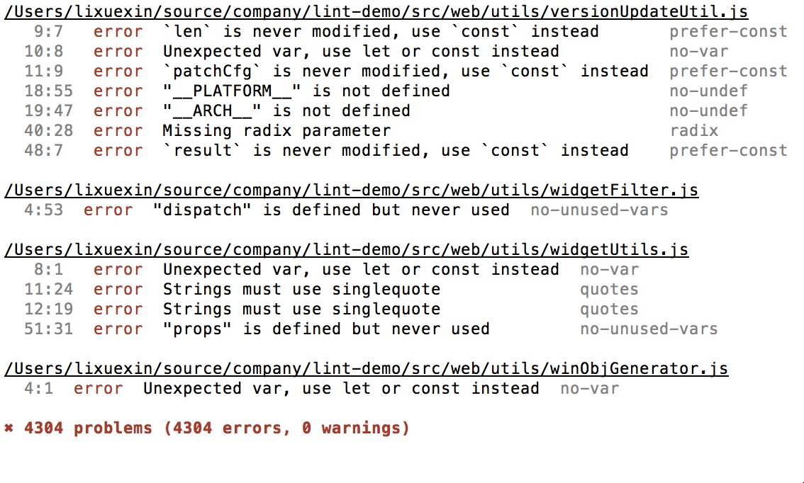
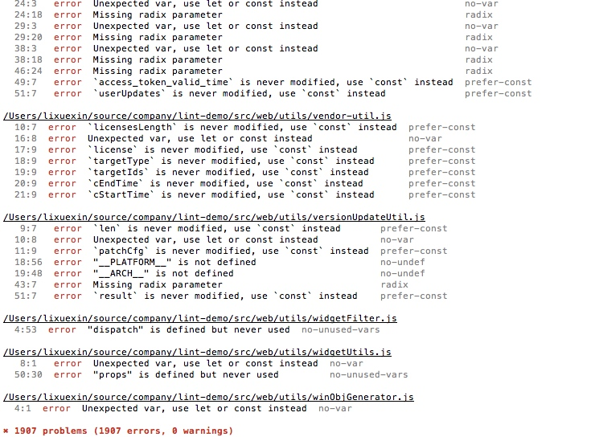
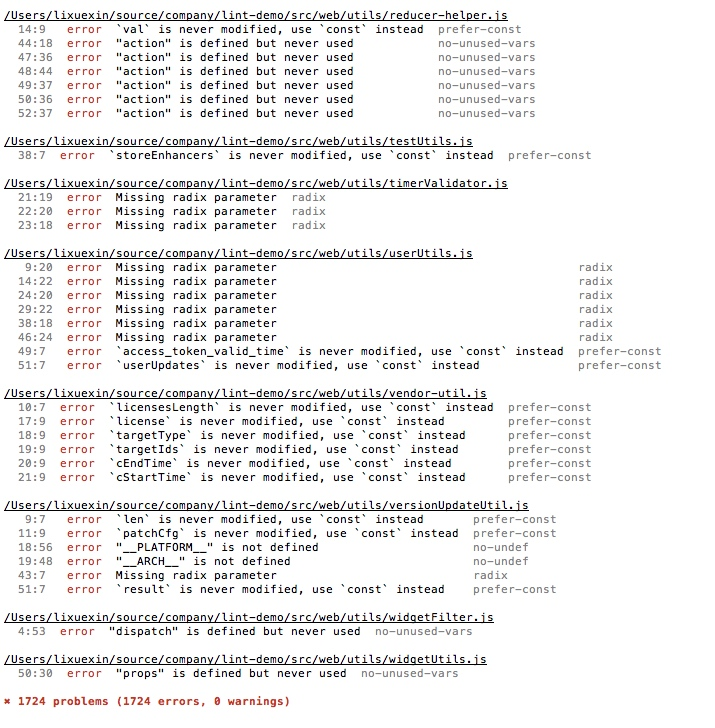

本文主要总结如何使用 eslint , prettier, 以及 jscodeshift 快速统一一个大型的 js 项目的代码风格,并结合 lint-staged 和 husky 自动检查并且格式化未来新提交的新代码.

<!--more-->

## 确认 lint 规则 , 执行 lint

项目是一个标准的 react+redux 项目,用 es6 编写,所以需要 `babel-eslint` 作为解析器直接解析 es6 代码.因为 react 使用了 jsx 代码,所以加了 `eslint-plugin-react` 这个额外的插件.

执行:

    yarn add -D eslint eslint eslint-plugin-react babel-eslint

安装所有依赖.

`.eslintrc.js` 配置如下:

```js
module.exports = {
  extends: ["eslint:recommended"],
  parser: "babel-eslint",
  plugins: ["react"],
  env: {
    browser: true,
    node: true,
    es6: true,
    jest: true
  }
};
```

基于 eslint 官方推荐的[规则](http://eslint.org/docs/rules/).

在 package.json 的 script 里面新加一条 `lint:"eslint src --ext .jsx,.jsx"`, 意思是 lint 项目 src 下面所有的 js 和 jsx 文件.

根据项目规模会查出好多潜在的代码问题,比如如下这个项目.




看到 4 千多个错误,我的内心是如上图所示 😂.

## 修复有问题的代码

扫描了一下错误,大致有以下几类错误:

1.  `quotes`: 必须使用单引号,而不是双引号表示字符串.
2.  `prefer-template`: 使用模板字符串操作字符串拼接.
3.  `key-spacing`: 关键字之间的空格样式问题.
4.  `brace-style`: 大括号的样式
5.  `indent`:缩进 2 两个空格.
6.  `prefer-const`: 使用 `const` 关键字表示所有不会被修改的变量.
7.  `no-var`: 不使用 `var` 表示变量,而是使用 `let`.
8.  `no-unused-vars`:不允许定义了但是未使用的变量.
9.  `eqeqeq`: 使用全等 `===` 比较
10. `no-undef`: 变量未定义

eslint 检查出来的错误大致分为两种,一种是代码风格方面的,前五个就是这个类型,统一它们可以提高代码的可读性.另一种是代码质量方面的,后五种就是这种类型,通过改进这些问题能够避免一些潜在的错误并提高代码的可靠度.

通过给 eslint cli 加 `--fix` 参数能自动修复一些简单的错误.在我运行之后发现项目还剩下 3000 多个错误.剩余的大部分是代码质量方面的.但是代码风格方面还是遗留了少量问题.

这个时候需要 `eslint --fix` 指令的加强版工具 [prettier](https://github.com/prettier/prettier) 出现了.


### 使用 prettier 和 eslint 修复所有样式错误

prettier 是一个强大的代码格式化工具,它能自动格式化 es6, jsx, flow,typescript 和 css , less, scss.它使用内置的代码样式规则,基本上是个傻瓜型的全能代码格式化利器.

> 注意:prettier 会重写所有的代码,基本上是重写了整个 js 或者 css 文件,所以会产生大量的代码差异. 所以务必在一个单独的开发时间内统一去做 lint 和格式化的工作,并确保之后的开发是修改基于格式化之后的.以免 git 合并产生大量冲突.

在使用`yarn global add prettier`全局安装了 prettier 之后在项目下面执行如下命令:

    prettier --write --trailing-comma es5 --single-quote "src/**/*.{js,jsx,css}"

这句话的意思是格式化 src 下面所有的 js,jsx 和 css 文件.

1.  `--write`:表示格式化后直接修改文件
2.  `--trailing-comma es5`: 行尾逗号规则, `es5`表示当对象,数组的最后一项在换行的时候加逗号,类似 eslint 的 [comma-dangle](http://eslint.org/docs/rules/comma-dangle) 规则.
3.  `--single-quote`:强制使用单引号表示字符串.

经历了以上命令的折腾,在执行 lint 命令,错误降到了 1900,差不多少了一半.



接下来该`js-codemod`登场了.

### 使用 js-codemod 转换 js 代码

[js-codemode](https://github.com/cpojer/js-codemod)是一个代码转换工具,基于 fb 的 [jscodeshift](https://github.com/facebook/jscodeshift)框架.首先使用

    yarn add global jscodeshift

在项目的同级目录,执行全局安装这个框架.之后执行

    git clone https://github.com/cpojer/js-codemod.git

获取 `js-codemod`

关于 js-codemod 每条规则的详细用法,可以参考[Turbocharged JavaScript Refactoring with Codemods](https://medium.com/airbnb-engineering/turbocharged-javascript-refactoring-with-codemods-b0cae8b326b9).

我的项目只使用了其中几个会报错的:

[no-var](https://github.com/cpojer/js-codemod#no-vars):去掉 `var`.

    jscodeshift -t js-codemod/transforms/no-vars.js ./lint-demo/src

[template-literals](https://github.com/cpojer/js-codemod#template-literals):使用模板字符串代替字符串拼接.

    jscodeshift -t js-codemod/transforms/template-literals.js ./lint-demo/src

经历了上述指令,lint 结果又少了一点:



js-codemod 的 `no-vars`指令还有一点缺陷,没法帮我们把 let 转成 const, 所以 eslint 还是会报 `prefer-const`的错误.

剩余的错误种类其实很少:

1.  prefer-const:使用 const 声明不变量.
2.  no-undef:不能使用未定义的变量
3.  radix:使用 parseInt 强制指定进制.
4.  no-unused-vars:去掉定义/或者 import 了但是未使用的变量.

这四种目前为止没有工具帮我们转换,必须手动改.我们的策略是团队成员每个人认领几个文件夹,各自修改这些错误.因为我个人使用 webstorm,下面说一些 webstorm 下面如何快速查看 eslint 的错误并且修改.

首先启用 webstorm 的 eslint 支持:[ESLint in Webstrom](https://www.jetbrains.com/help/webstorm/2017.1/eslint.html).之后 IDE 就能自动读取项目的 eslint 配置并且在错误的代码右边自动标红.我们点击就能快速修改.

放段操作压压惊.

![2017-06-22 23_36_58]\(<http://7xqh45.com1.z0.glb.clouddn.com/2017-06-23-2017-06-22> 23_36_58.gif)

> 在应用`no-unused-vars`的时候要格外小心,不要删错东西.

以下就是血的教训.
比如

```js
const foobar = (a, b) => b;
foobar(null, 3);
```

这段代码 foobar 函数的实现里面没有用到 a, 如果我们鲁莽的删掉了 a 这个形参而不改变调用 foorbar 是传给它的实参的数量,就会导致 b 变成 null. 然后这种蛋疼的 bug 要查半天~.

## 使用 husky 结合 lint-staged 保证未来代码质量

经历了上述一番折腾,终于我们项目里面的代码符合 iso9001 国际质量体系认证了 🤣🤣.

但是问题是如何确保以后的修改也都符合标准呢? 这个时候你需要一只哈士奇~


[husky](https://github.com/typicode/husky):哈士奇把 [git 钩子](https://github.com/typicode/husky/blob/master/HOOKS.md)的功能加到了 package 的 script 里面了.使我们有能力直接调用其他命令而不用把钩子脚本写在项目的 `.git/hook` 里面, 方便团队间 git 钩子命令的共享.

[lint-staged](https://github.com/okonet/lint-staged):这个库检查所有被 `git add` 加入的文件,对这些文件执行你需要的某些命令,在这里,我们可以执行 eslint 和格式化相关的操作.

具体脚本 github 写的很清楚了:

    {
      "scripts": {
        "precommit": "lint-staged"
      },
      "lint-staged": {
        "*.js": ["eslint --fix", "git add"]
      }
    }

脚本下面新增一个命令 precommit(这个名字是 git 钩子名字,所以必须这么写),再新增一个`lint-staged`配置项(这个名字也是写死的,因为 lint-staged 库依赖这个名字).但是这个配置项里面的内容是活的.

上述命令:

       "*.js": ["eslint --fix", "git add"]

的意思是对所有的 js 文件做检查并自动修复,然后把修复后的文件加入 git.

最后按照实际需求我把命令改成了如下形式供你们参考:

    "{src,dev}/**/*.{js,jsx}": [
      "eslint --fix",
      "prettier --write --trailing-comma es5 --single-quote",
      "git add"
    ]

针对 src 和 dev 下面所有的 js 和 jsx 文件.

1.  首先 eslint 并且尝试自动修复所有问题.
2.  再用 prettier 格式化所有被添加的代码.
3.  再把精美的格式化后的代码加入版本库.
4.  写 commit,push, 完美收工.
