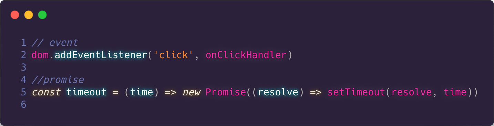
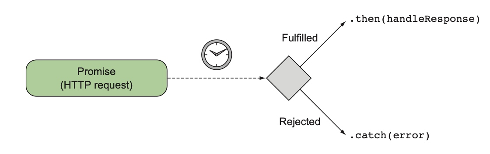
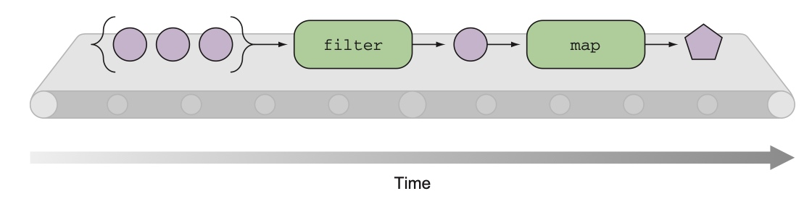
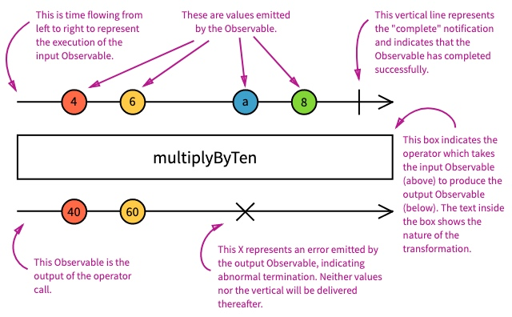
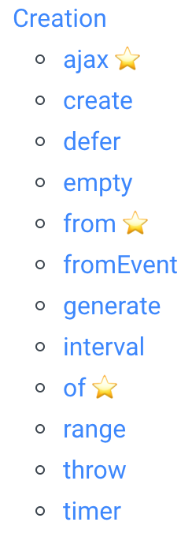
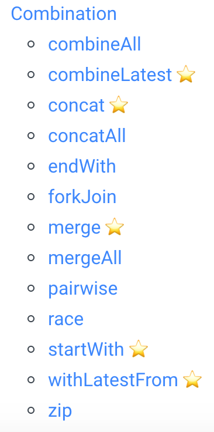
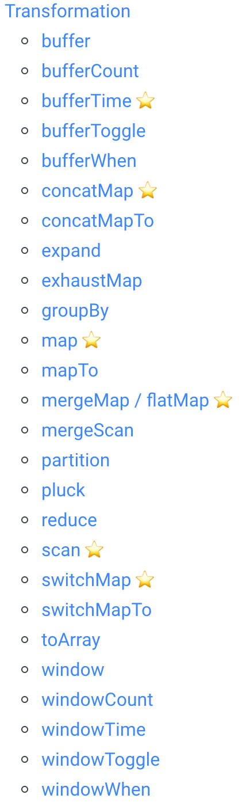
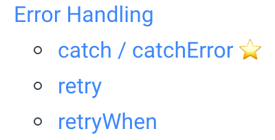
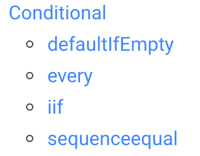

## 第一部分 简介

### 什么是 RxJS

先看一些来自官网的 RxJS 介绍：

>

- An API for asynchronous programming
  with observable **streams**. （利用 observable 流为异步编程设计的一套 API）
- RxJS is a library for **reactive programming** using **Observables**, to make it easier to compose **asynchronous** or **callback-based** code.（RxJS 是为响应式编程设计的库，它利用 Observables 模式方便我们编写基于异步组合或者回调的代码）
- **[ReactiveX](http://reactivex.io/)** combines the **[Observer pattern](https://en.wikipedia.org/wiki/Observer_pattern)** with the **[Iterator pattern](https://en.wikipedia.org/wiki/Iterator_pattern)** and **[functional programming](http://martinfowler.com/articles/collection-pipeline/#NestedOperatorExpressions)** with collections to fill the need for an ideal way of managing **sequences of events**.（ReactiveX 利用迭代器和观察者模式，函数式编程集合来优雅的编写和管理事件序列代码）
- Think of RxJS as **Lodash for events**.（RxJS 就是事件版本的 lodash）

完全没接触过 RxJS 的人一上来学这个库，可能会一脸懵逼，因为这个库提出了很多前端可能没有接触过的概念。首先说明下 RxJS 并不是 Javascript 独有的一个库，它是 Reactive extensions(Rx) 的特定语言实现版本。因此掌握了 RxJS 的思想，其实就是掌握了响应式编程的思想。Reactive extensions [最早](<https://docs.microsoft.com/en-us/previous-versions/dotnet/reactive-extensions/hh242985(v=vs.103)?redirectedfrom=MSDN>)可能是微软在 .net 框架作为响应式编程的一种特定实现提出来的。**它的最大目的是提供一系列抽象的操作符可以对数据进行转换，而不管这些数据来源是同步或异步的**。

## 第二部分 概念和应用

### 概念 1： 流

要理解异步或者同步，我们需要先明白非常重要的概念：**流**

流可能是一个陌生的名词，但是平时编写异步代码其实你都在接触类似的概念。比如 promise，eventTarget，fetch，setInterval。这些前端常用的异步技术，在 rxjs 看来，都可以归并到流的范畴。所以流有什么特点？

1.  它有发送数据的能力
2.  它有接受数据的能力
3.  它能对数据进行转换

举个例子, 下图展示的 promise 和 dom 事件就是流的不同展示。



流的概念具体在 rxjs 里面，就是 Observerable 和 Observer 的关系，

如下图所示：


<center><a href='https://www.manning.com/books/rxjs-in-action'>图片来源</a></center>

1.  它有发送数据的能力（Observerable）
2.  它有接受数据的能力 (Observer,Subscribe)
3.  它能对数据进行转换 (Operator)

### 概念 2：理解 Observable 和 Observer

作为 rxjs 里面流概念的载体，理解 Observable 非常重要。

由于 Observable 的创建方式和 Promise 有点像，因为用他们做对比学习可能效果更好。

- 典型的 promise 的流程：



<center><a href='https://www.manning.com/books/rxjs-in-action'>图片来源</a></center>

promise 是一次性的，在异步任务执行完毕后，promise 就被标记为 fullfilled 或者 rejected 状态。

- 典型的 Observable
  

<center><a href='https://www.manning.com/books/rxjs-in-action'>图片来源</a></center>

Observable 不是一次性的，在异步任务中可以通过 next 多次触发。只有收到 error 或者 complete，订阅才会结束。

- 对比 Promise 和 Observable

|               | Promise | Event | Observable |
| :------------ | :------ | :---- | :--------- |
| 惰性定义      | 不支持  | ？    | 支持       |
| 取消订阅      | 不支持  | 支持  | 支持       |
| 多值          | 不支持  | 支持  | 支持       |
| 共享多次/订阅 | 不支持  | 支持  | 支持       |

**以下示例所有代码[在线预览](https://stackblitz.com/edit/jo3dq1)**

#### 创建和订阅

假如我们想创建一个 等待特定时间后触发回调的 promise，用 observable 的创建过程会稍微啰嗦一点。

```typescript
//create.ts
import { Observable } from 'rxjs'; // highlight-line

//创建 promise
const promise = (time) =>
  new Promise((resolve) => setTimeout(() => resolve('ok'), time));

//订阅promise（200 毫秒后输出 ok）
promise(200).then(console.log);

//创建 observable
const observable = (time) =>
  new Observable((subscriber) => {
    setTimeout(() => {
      subscriber.next('ok');
      subscriber.complete();
    }, time);
  });

//
const observer1 = {
  next: console.log,
  complete: () => console.log('complete'),
  error: (e) => console.error(e),
};
const observer2 = console.log;

// 订阅 observable 这两种写法效果一样.
// 第一种是完整写法.observer1 定义了所有的回调函数
//observable(200).subscribe(observer1);
// 第二种是简写,当 rxjs 发现 observer  是一个函数时,它将把这个函数作为 next 被回调(一般用这种)
observable(200).subscribe(observer2);
```

这个例子说明了 rxjs 里面 Observable，Observer 以及 Subscription 的关系。简单来说 Observable 用来包装事件发送，Observer 定义回调消费事件。调用 Observable.subscribe 的过程就是订阅，它将返回一个 Subscription 对象方便后续的取消。

#### 取消订阅

和 promise 一旦订阅了就无法取消不一样，Observable 是可以取消的。这个特定在一些场合非常有用，比如可以帮助我们取消 xhr 的网络请求。

```javascript
//cancel.ts
import { Observable } from 'rxjs';
const observable = (time) =>
  new Observable((subscriber) => {
    const id = setTimeout(() => {
      subscriber.next('ok');
      subscriber.complete();
    }, time);

    // 虽然订阅被取消了,但是 setTimeout 的计时器依然在运行,
    // 因此我们需要手动取消 setTimeout. 如果 Observable 接受
    // 的参数的返回值是一个函数,这个函数将在 Observable 被取消
    // 订阅是被触发(是不是觉得这个用法和 react 的 useEffect 很像??)
    return () => {
      clearTimeout(id);
    };
  });

// subscribe 将返回一个 subscription 对象,拥有 unsubscribe 取消订阅
const subscription = observable(200).subscribe(console.log);

//在最新的值到达前取消监听,此时将收不到 ok
setTimeout(() => subscription.unsubscribe(), 100);

//在最新的值到达后取消监听,此时依然能收到 ok
//setTimeout(() => subscription.unsubscribe(), 300);
```

#### 惰性定义

什么是惰性定义？简单的说就是当创建事件发送的逻辑时，所有的逻辑是在订阅后才执行还是在定义的时候就执行了

```javascript
///lazy.ts

import { Observable } from 'rxjs';

//创建 promise
const promise = new Promise((resolve) => {
  console.log('run promise');
  setTimeout(() => resolve('ok'), 2000);
});

//订阅promise
// promise.then(console.log);

//创建 observable
const observable = new Observable((subscriber) => {
  console.log('run observable');
  setTimeout(() => {
    subscriber.next('ok');
    subscriber.complete();
  }, 2000);
});

// observable.subscribe(console.log);
```

这段代码，我们先注释掉 promise 和 observable 的订阅，可以发现 `run promise` 依然被输出了，说明 promise 只要创建就会立刻运行。所以通常我们都会把 promise 用函数包一下，这样只有在调用函数的时候才会触发 promise 的实例化。

```javascript
const promise = () =>
  new Promise((resolve) => {
    console.log('run promise');
    setTimeout(() => resolve('ok'), 2000);
  });
```

#### 多值

promise 是只为单个值设计的，所以当收到一个值之后这个 promise 就结束了。但是 observable 不是，只要没有 complete 或者出现 error，它可以发送多个值。

```javascript
//multi.ts
import { Observable } from 'rxjs';

//创建 observable
const observable = new Observable((subscriber) => {
  let count = 0;
  const id = setInterval(() => {
    subscriber.next(++count);
  }, 1000);

  return () => {
    clearInterval(id);
  };
});

//每间一秒加一
const sub = observable.subscribe(console.log);
//两秒后取消监听，导致事件停止发送
setTimeout(() => sub.unsubscribe(), 2000);
```

Observable 的概念是整个 rxjs 的基础，所以务必需要掌握它。

有了 Observable 的基础认识之后，我们就可以学习 rxjs 的核心亮点：操作符了。

### 概念 3： 操作符

#### 函数式编程简述

在说操作符之前，先稍微介绍下函数式编程。**因为在你明白了操作符的基本原理后，你就会发现所有的操作符其实基本是纯函数**。

fp 是一种编程范式，也就是新的编程思想。他和其他编程范式比如过程式，面向对象式不同，不强调数据封装，更加强调数据转换。很多编程语言特别强调这种思想，比如 Lisp，Haskell，Erlang。js 虽然不是主打函数式编程，但是它也然可以实现函数式编程的一些思想。

先来看一段伪函数式代码：

```javascript
//function.ts
const input = [1, 2, 3, 4, 5];
const output = input.map((item) => item * 2).filter((item) => item > 5);
console.log(output);
```

这段代码它调用了数组的 map，和 filter 方法，这两个方法接受的参数是一个函数，所以是函数式的。函数式代码能生效的大前提就是函数可以作为基本变量被传递。

那这段代码为啥是伪函数式呢，因为它的形式用了类的链式调用，而不是函数的管道式调用。map 和 filter 是定义在数组原型链上的方法，属于面向对象的编程模式（封装方法）。而且这个方法只能处理数组，如果我来了一个哈希怎么办，原则上所有可被迭代的数据都能被 map（参考迭代器模式）。

通常我喜欢用 lodash 对数据做遍历。lodash 暴露了大量函数，它的 map 和 filter 就可以遍历数组或者哈希。

```javascript
//function.ts
import _ from 'lodash';
const input = { a: 1, b: 2, c: 3, d: 4, e: 5 };
const output = _.filter(
  _.map(input, (item) => item * 2),
  (item) => item > 5
);
console.log(output);
```

但是这段代码的可读性没有上面那一段好，因为用这种方法，随着函数嵌套调用的次数越多，代码可读性越差。 怎么优化？是时候科普性 **管道式调用** 了。

```javascript
//function.ts
const pipe = (...functions) => (args) =>
  functions.reduce((arg, fn) => fn(arg), args);

const map = (fn) => (input) => _.map(input, fn);
const filter = (fn) => (input) => _.filter(input, fn);

const map2 = map((item) => item * 2);
const filter5 = filter((item) => item > 5);

const input = { a: 1, b: 2, c: 3, d: 4, e: 5 };
const composedFn = pipe(map2, filter5);

const output = composedFn(input);
console.log(output);
```

管道式调用有什么特点？

1.  高阶函数: 一个函数的返回值是另一个函数（curry）
2.  输入和输出的数据类型是一致的
3.  惰性求值（ pionter free）
4.  各种工具函数 （js 有个函数式编程库，封装了大量函数 rambda.js）

好了，函数式编程范式大概就是这么个套路，那么为什么要介绍管道式调用呢？因为这种风格就是 rxjs 里面操作符的调用风格。

```javascript
//operator_basic.ts
//创建类的操作符全部在 rxjs 包里面
import { of, timer } from 'rxjs';
//其他在 rxjs/operator 包里面
import { map, filter } from 'rxjs/operators';

//实现刚刚类似数据的遍历,不过注意 console 结果的关系
of(1, 2, 3, 4, 5)
  .pipe(
    map((item) => item * 2),
    filter((item) => item > 5)
  )
  .subscribe(console.log);

//刚刚的超时代码
timer(2000).subscribe(console.log);
```



<center><a href='https://www.manning.com/books/rxjs-in-action'>图片来源</a></center>

在 rxjs 里面，操作符被分成了两种，从 `rxjs` 路径导入的操作符被称为**创建操作符**，从`rxjs/operators` 路径导入的被称为**管道操作符**。

创建操作符用来把 js 世界里面其他的数据结构转换成流，可以被转换的数据结构包括 promise，事件，基本类型和可迭代类型等。

管道操作符接受一个 Observable，然后根据特定操作符的逻辑监听 Observable 的输出。如果你理解了上述函数管道式调用，那么你就能自己实现一遍 rxjs 的 map 和 filter:

#### 自定义操作符

```javascript
//custom_operator
//创建类的操作符全部在 rxjs 包里面
import { of, timer, Observable } from "rxjs";
//其他在 rxjs/operator 包里面
// import { map, filter } from "rxjs/operators";

//自己简单的实现
const map = fn => observable => {
  return new Observable(sucribe => {
    observable.subscribe(item => {
      sucribe.next(fn(item));
    });
  });
};

const filter = fn => observable => {
  return new Observable(sucribe => {
    observable.subscribe(item => {
      fn(item) && sucribe.next(item);
    });
  });
};

//实现刚刚类似数据的遍历,不过注意 console 结果的关系
of(1, 2, 3, 4, 5)
  .pipe(
    filter(item => item > 2)，
     map(item => item * 2)
  )
  .subscribe(console.log);
```

#### 操作符的主要分类

在介绍操作符之前，先看一下官网推荐的学习操作符的方式：弹珠图。



推荐几个网站：

- [操作符决策树](https://rxjs-dev.firebaseapp.com/operator-decision-tree)
- [用动画展示一些容易混淆的操作符的区别](https://reactive.how/)
- [用例子解释了绝大多数数操作符的用法](https://www.learnrxjs.io)
- [可交互的弹珠图](https://rxmarbles.com/)

操作符的功能按照对数据的处理方式可以分成八大类，距离可以参考[这里获取所有列表](https://www.learnrxjs.io/learn-rxjs/operators)

##### 创建操作符

使用 Observable 的起点，用来方便我们创建流。



###### from vs of

###### timer vs interval

```javascript
import {
  from,
  of,
  fromEvent,
  bindNodeCallback,
  defer,
  timer,
  interval,
} from 'rxjs';

//from 和 of 操作符很容易搞混, 基本上平时 from 的使用频率会比 of 高. from 可以转换其他流对象(promise,iterator)为 Observable
of(1, 2, 3);

from([1, 2, 3]);

from(of(1, 2, 3));

//这个方式等价于 document.getElementById("button").addEventListener('click',??); 不过回调函数可以分开订阅.
fromEvent(document.getElementById('button'), 'click');

//把 node 回调转换为 Observable
// const readFile$$ = bindNodeCallback(fs.readFile)
// readFile$$('./path').subscribe()

//通常和 iif,retry 等配合使用,用来在运行时惰性定义.

defer(() => Promise.resolve());

//相当于 setTimeout
timer(2000);

//相当于 setInterval
interval(2000);
```

##### 过滤操作符

对数据的数量做处理，但保持数据格式不变，类似数组的 filter


###### throttle vs debounce

###### takeUnitl vs takeWhile

##### 合并操作符

将多个流合并成一个流方便后续处理。



###### merge vs concat

###### combineLatest vs zip

##### 转换操作符

对数据的数量不作处理，但是改变数据的结构定义。类似数据的 map。



###### map vs mergeMap vs exhaustMap vs switchMap vs concatMap

```javascript
fromEvent(document.getElementById('button'), 'click').pipe(
  scan((acc, cur) => acc + 1, 0),
  map((item) => item * 1000)
);
```

这段代码演示了 map 的用法，它监听鼠标点击，然后算到累计值上面，最后把当前的累计值乘以 1000 输出。

订阅这个流后，当点击鼠标，你将会收到`1000,2000,3000`等值。 现在我们变更需求，希望在鼠标点击后，延迟 n 秒后再输出这个值。 比如点击一下后，1 秒后输出值，点击第二下后，2 秒后输出值。

```javascript
fromEvent(document.getElementById('button'), 'click').pipe(
  scan((acc, cur) => acc + 1, 0),
  map((item) => timer(item * 1000).pipe(mapTo(item)))
);
```

这段代码并不能很好的工作，当每次鼠标点击后，订阅流会**立刻**收到一个 Observable。所以这里需要说明另一个概念：高阶 Observable。

这段代码没有按照希望的执行的主要原因是 map 返回的值不是数字，而是**子 Observable**。这个**子 Observable**就是高阶 Observable，和上述函数式提到的高阶函数有点类似。我们需要订阅这个**子 Observable**，然后在其有值后输出。rxs 有个操作符就是干这个的 `mergeMap`。在理解了 MergeMap 的定义之后，我们可以自己实现一遍：

```typescript
const mergeMap = (fn) => (observable) => {
  return new Observable((sucribe) => {
    const sub = observable.subscribe((item) => {
      //用 from 把 fn(item)转成 Observerable
      from(fn(item)).subscribe((innerItem) => {
        sucribe.next(innerItem);
      });
    });

    return () => {
      sub.unsubscribe();
    };
  });
};

fromEvent(document.getElementById('button'), 'click')
  .pipe(
    scan((acc, cur) => acc + 1, 0),
    tap(console.log),
    mergeMap((item) => timer(item * 1000).pipe(mapTo(item)))
  )
  .subscribe(console.log);
```

和 mergeMap 很像的还有另外三个操作符

- mergeMap: 并发的执行子 Observable
- concatMap: 等上一个子 Observable 执行完毕后再执行当前，队列执行
- switchMap:订阅当前的子 Observable，停止执行之前的所有子 Observable
- exhaustMap:在当前的子 Observable 没有执行前，忽略所有其他新来的创建子 Observable 请求

具体建议[自己运行](https://stackblitz.com/edit/jo3dq1?file=transform_operator.ts)感受下

##### 错误处理



##### 工具 && 条件 && 多播





## 第三部分 总结

通过 RxJS，我们可以把原来冗长的异步代码全部用它的操作符管道全部包起来，可以大幅减少中间全局状态的维护。而且在 RxJS 取消订阅时，会自动取消所有 Observable 的订阅。

RxJS 操作符学习这块建议先从上面列举的操作符中包含星号的开始，每个操作符和乐高积木差不多。将他们组合起来的威力是非常巨大的。

当然 RxJS 也是有缺点的，除了学习门槛过高外，它的错误堆栈非常的深，有一个叫做[rxjs-spy](https://github.com/cartant/rxjs-spy)的库，可以尝试了解下。

### 参考链接:

[RxJS: Glossary And Semantics](https://github.com/ReactiveX/rxjs/blob/master/docs_app/content/guide/glossary-and-semantics.md): 关于 RxJS 各种术语的定义.
